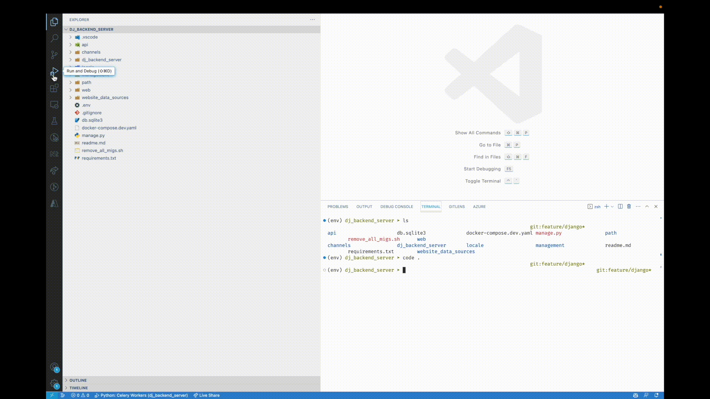

# Welcome to the New Python-Based Application Readme Guide

Thank you for joining us as a beta tester or developer for our cutting-edge Python-based application! This guide will walk you through the process of getting started with the application and utilizing its exciting features.

## Table of Contents
- [Introduction](#introduction)
- [Getting Started](#getting-started)
- [Configuration](#configuration)
- [Running the Application](#running-the-application)
- [Compatibility](#compatibility)
- [Feedback and Support](#feedback-and-support)

## Introduction
As a beta tester or developer, you're getting an exclusive early access to this technology that's still in its infancy. We've worked hard to ensure compatibility with your databases and an intuitive experience.

## Getting Started
Before you dive into the exciting world of our new application, there are a few steps you need to follow to get everything set up.

## Configuration
To ensure the application works seamlessly with your environment, you'll need to configure a few settings.

1. **Environment Configuration:** To run the app in Docker, open the `example.env` file in the root directory of the project. Update the required environment variables, such as database credentials, API keys, etc. After making the changes, rename the file to `.env.docker` and then run `make install`. To run the app in development environment, just rename example.env to .env

## Running the Application

**1. Launch the Backend Server as a Docker Container:**

1. switch to python directory, `cd dj_backend_server`
To initiate the app, execute the following command:
First run "make preinstall" to create .env file and venv environment

```bash
make preinstall
```

You will need to edit .env file, it will be created from example.env
After .env is done, run "make install" to create run the nginx and docker-compose. 
Doublecheck if the nginx.conf is correct, if not, edit it and run "make install" again

```bash
make install
```

If you want to run the app in development mode, run "make dev-start" and to stop the app, run "make dev-stop"

To see the logs, run "make logs"

```bash
make logs
```

To enter the python container, run "make exec"

```bash
make exec
```

To restart the python and celery containers, run "make restart"

```bash
make restart
```

To stop the server run "make down" (in dev mode, run "make dev-stop"), use:

```bash
make down
```

**Local Machine Deployment for Development:**

- For server launch:
  ```bash
  python manage.py runserver
  ```

- For running background processes:
  ```bash
  # Mac M1 Chip Flags (if issues occur with fork)
  export OBJC_DISABLE_INITIALIZE_FORK_SAFETY=YES && export DISABLE_SPRING=true

  # Running Celery Worker
  celery -A dj_backend_server worker --loglevel=info
  ```

## User creation

Create a Superuser. Login into docker 

```bash
docker exec -it web /bin/bash
```

and execute command 

```bash
python manage.py createsuperuser
```

This will prompt you to enter a username, email, and password for the superuser. After this, you can use username and password to login.

2. **Access the Application:** Open your web browser and navigate to the provided URL (`http://localhost:8000`) to access the application.


2.1 **Making the Most of Hot Reloading as a developer**

   1. **Rename Configuration File:** Modify the name of the `example.env` file to `.env`.

   2. **Synchronize Models:** Execute the command `python manage.py sync_models.py` to align the models.

   3. **Launch the Server:** Begin the server by using the command `python manage.py runserver`.

   4. **Activate Celery:** Initiate Celery by running the command `celery -A dj_backend_server worker --loglevel=info`.

   5. **Optional: Debugging in Visual Studio Code:** If you're employing Visual Studio Code, the source code includes convenient debug scripts. You can utilize these scripts for debugging purposes. Please disregard the step mentioned in 4 if you choose this option.

   

With these steps, you can make the most of hot reloading and enhance your development experience.

## Compatibility
We understand the importance of seamless integration with your existing databases. Our team has worked diligently to ensure compatibility so that you can continue to use and enjoy the chatbots you've created earlier.

If you're migrating from PHP to Python, it's important to handle volume mounting correctly. This ensures that your data remains accessible and functional. Additionally, you can opt for a migration script if that suits your needs better.

## Feedback and Support
Your feedback is incredibly important to us as a beta tester and developer. If you come across any problems, have ideas to share, or simply want to tell us about your experience, please don't hesitate to get in touch. You can use the GitHub issue tracker or join our community forum on Discord, named "Openchat".

Thank you for being a part of this exciting journey as we shape the future of chatbot technology together! Your enthusiasm and insights will drive our application to new heights.

Happy coding and exploring!
